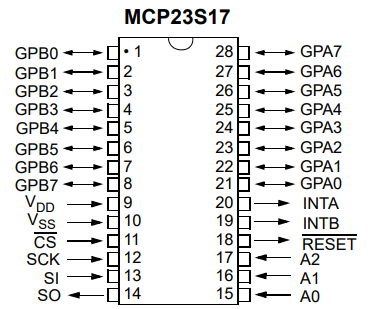
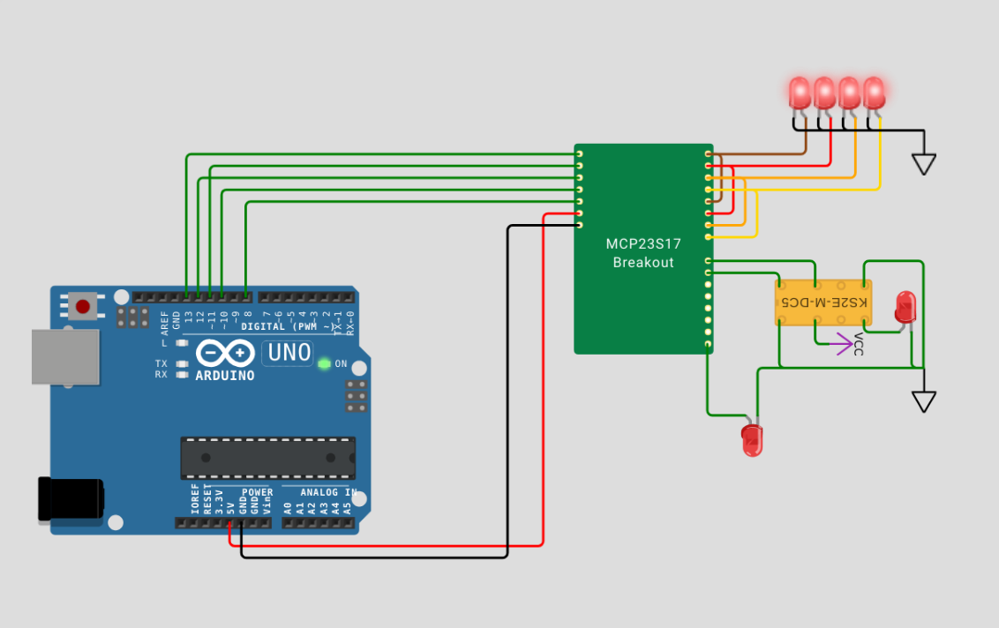

# MCP23S17 Chip 
Simulation chip for [Wokwi](https://wokwi.com/)
Based on template: https://github.com/wokwi/inverter-chip

## Pin names

| Name | Description              |
| ---- | ------------------------ |
| SCK  | SPI Clock                |
| MOSI | Data IN                  |
| CS   | Chip Select              |
| DS   | DS                       |
| RST  | Reset                    |
| VCC  | VCC                      |
| GND  | Supply voltage           |
| A0-7 | A GPIO (Bank 0)          |
| B0-7 | B GPIO (Bank 1)          |



## Implementation
- IODIR - I/O Direction
- IPOL - I/O Polarity Inversion
- IOCON - Configuration Register
- GPIO - Read/Write port information


- Note: Inturruption handling is not implemented at this time. PRs welcome.
- Note: Sequential Write/Read is not supported (Only Single Read/Write is currently supported).
- Note: Only BANK=0 mode is supported.

Datasheet: https://ww1.microchip.com/downloads/aemDocuments/documents/APID/ProductDocuments/DataSheets/MCP23017-Data-Sheet-DS20001952.pdf


## Usage

Tested with https://github.com/RobTillaart/MCP23S17.

To use this chip in your project, include it as a dependency in your `diagram.json` file:

```json
  "dependencies": {
    "mcp23s17": "github:martysweet/mcp23s17-wokwi-chip@1.0.0"
  }
```

Then, add the chip to your circuit by adding a `mcp23s17` item to the `parts` section of diagram.json:

```json
  "parts": {
    ...,
    { "type": "chip-mcp23s17", "id": "multiplexer" }
  },
```

## Screenshot


# Development

The actual source code for the chip lives in [src/main.c](src/main.c), and the pins are described in [chip.json](chip.json).

## Building

The easiest way to build the project is to open it inside a Visual Studio Code dev container, and then run the `make` command.

## Testing

You can test this project using the [Wokwi extension for VS Code](https://marketplace.visualstudio.com/items?itemName=wokwi.wokwi-vscode). Open the project with Visual Studio Code, press "F1" and select "Wokwi: Start Simulator".

If you want to make changes to the test project firmware, see the test folder, and then run `make test` to rebuild the .hex file. You'll need the [arduino-cli](https://arduino.github.io/arduino-cli/latest/installation/), which is already installed in the dev container.

## License

This project is licensed under the MIT license. See the [LICENSE](LICENSE) file for more details.
